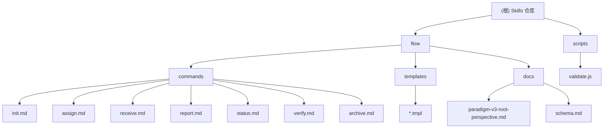

# Skills — AI 技能集合仓库

> 多 Agent 编排与开发辅助技能的集中管理仓库。

---

## 项目愿景

构建一套可复用、可扩展的 Claude Code Skill 体系，以标准化命令和模板降低多 Agent 协作的复杂度，使根 Agent（编排者）与子 Agent（执行者）之间的任务流转、进度追踪、接口契约验证形成闭环。

---

## 架构总览

本仓库采用**扁平模块结构**：根目录下按技能域划分独立模块，每个模块包含自己的命令定义、模板文件和设计文档。模块之间无代码依赖，可独立安装、独立演进。

当前模块：
- `flow/` — 多 Agent 编排工作流 Skill（核心模块）

---

## 模块结构图



---

## 模块索引

| 模块 | 路径 | 语言/类型 | 一句话职责 |
|------|------|-----------|-----------|
| flow | `flow/` | Markdown / Claude Code Skill | 多 Agent 编排工作流，管理根 Agent 与子 Agent 的协作全生命周期 |

---

## 运行与开发

### 安装 flow Skill

参见 [`flow/README.md`](flow/README.md) 或 [`flow/CLAUDE.md`](flow/CLAUDE.md) 中的安装说明。

```bash
ln -s /path/to/skills/flow/commands ~/.claude/commands/flow
```

### 命令一览

| 命令 | 角色 | 说明 |
|------|------|------|
| `/flow:init` | 根 agent | 初始化项目或创建新需求 |
| `/flow:assign <service>` | 根 agent | 为指定服务生成子 agent 指令包 |
| `/flow:status [change]` | 根 agent | 查看需求在各服务的进度 |
| `/flow:verify [change]` | 根 agent | 验证跨服务接口契约一致性 |
| `/flow:archive [change]` | 根 agent | 归档已完成的需求 |
| `/flow:receive` | 子 agent | 接收并启动分配的任务 |
| `/flow:report` | 子 agent | 提交结构化完成汇报 |

---

## 测试策略

本仓库为纯文档/模板型项目，无自动化测试套件。

- **验证方式**：在 Claude Code 中安装后，通过实际对话测试各命令的行为是否符合预期。
- **静态检查**：运行 `node scripts/validate.js` 检查命令 frontmatter 完整性、模板 Handlebars 语法、模板引用一致性。
- **回归检查**：修改 `commands/*.md` 后，检查命令的 YAML frontmatter（name/description/category/tags/version）是否完整。
- **模板校验**：修改 `templates/*.tmpl` 后，检查变量占位符是否与命令文件中的渲染逻辑一致。

---

## 编码规范

- **命令文件**：使用 YAML frontmatter 定义元数据，正文使用 Markdown 描述行为逻辑。
- **模板文件**：使用 Handlebars 语法（`{{variable}}`、`{{#if}}`、`{{#each}}`）。
- **命名约定**：命令文件名与命令名一致（kebab-case），模板文件使用 `.tmpl` 后缀。
- **路径引用**：命令中涉及的路径优先使用相对路径描述，实际生成内容时使用绝对路径（子 agent 可能在不同目录工作）。

---

## AI 使用指引

- **新增 Skill**：在根目录创建新模块目录（如 `opsx/`），参照 `flow/` 的结构组织 `commands/`、`templates/`、`docs/`。
- **修改 flow**：优先阅读 `flow/docs/paradigm-v3-root-perspective.md` 理解设计范式，再修改命令或模板。
- **模板变量**：修改模板时，同步检查使用该模板的命令文件中的变量注入逻辑。
- **不要硬编码**：所有项目特定的路径、名称、约定应从 `.flow/config.yaml` 读取（由 `init` 命令生成）。

---

## 变更记录 (Changelog)

### 2026-04-22（优化迭代）
- 精简 `README.md`，去重信息统一指向 `CLAUDE.md`。
- 修正 `.gitignore` 为文档/模板项目适用。
- 移除所有硬编码项目路径，统一使用模板变量与占位符。
- 统一 `assign.md` 命令与模板格式，新增 `child-config.yaml.tmpl`。
- 增加 Schema 规范文档（`flow/docs/schema.md`）。
- 增加基础验证脚本（`scripts/validate.js`）。
- 增加 `CHANGELOG.md` 与命令 `version` 字段。
- 完善命令逻辑：跨平台归档、状态优先级、report 检测规则、Tier 3 标注。

### 2026-04-22 15:33:54
- 初始化项目 AI 上下文文档（`CLAUDE.md`、模块级 `CLAUDE.md`、`.claude/index.json`）。
- 完成全仓清点：识别 1 个模块（flow），扫描 17 个文件。
- 生成 Mermaid 模块结构图与导航面包屑。
