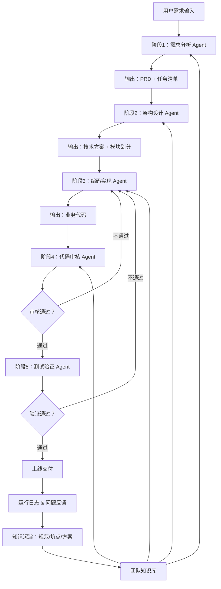
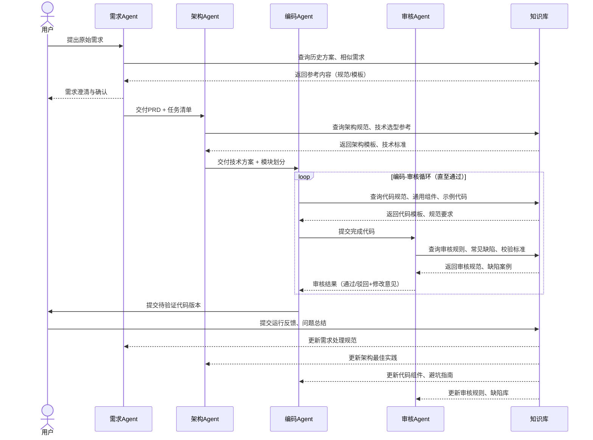

# 多阶段AI自动化开发流程（含Mermaid流程图）

本文档包含两个可直接渲染的Mermaid流程图，复制全部内容保存为\.md文件，可在Obsidian、GitBook、Notion等支持Mermaid的编辑器中打开，无需修改即可正常显示。

## 一、多阶段AI开发流程（含知识库闭环）

## 二、人员 \+ Agent 协作时序图

## 使用说明

- 复制本文档全部内容，保存为「多阶段AI开发流程\.md」文件

- 打开支持Mermaid的Markdown编辑器（如Obsidian、Notion、GitBook等），即可自动渲染流程图

- 流程图可直接修改、导出，无需额外配置

> （注：文档部分内容可能由 AI 生成）
