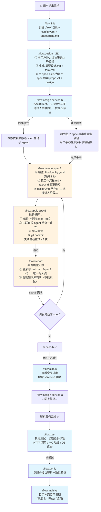
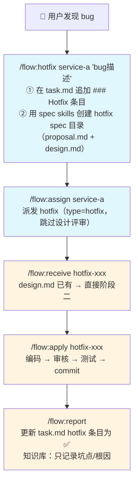
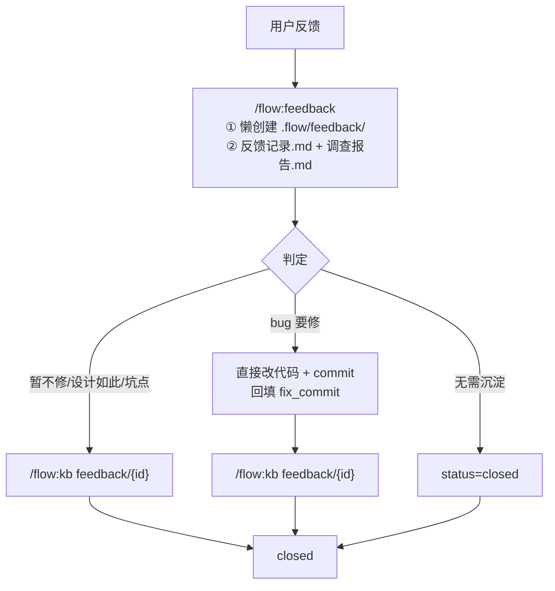
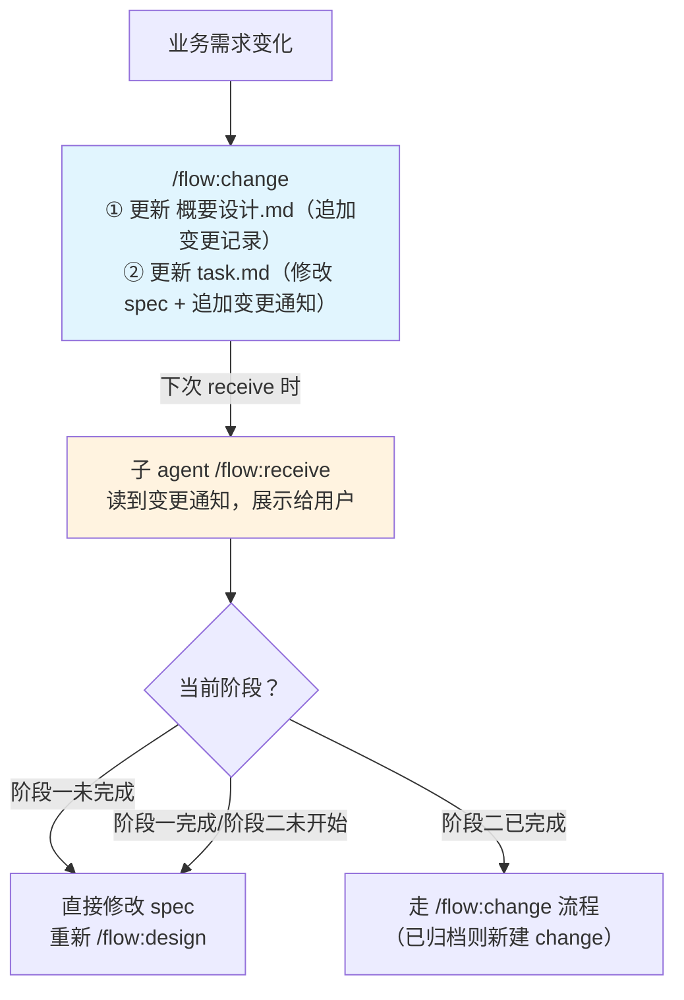
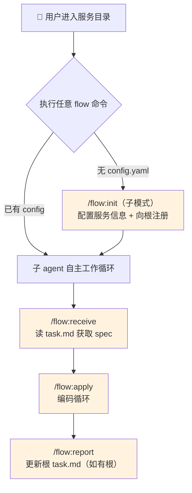
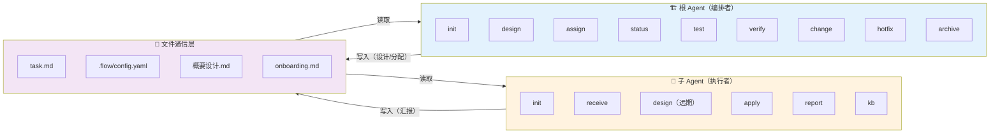
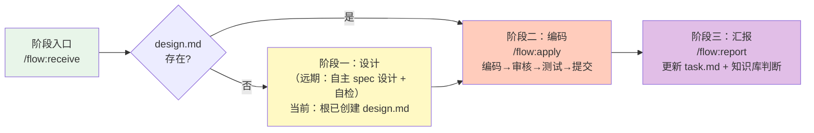
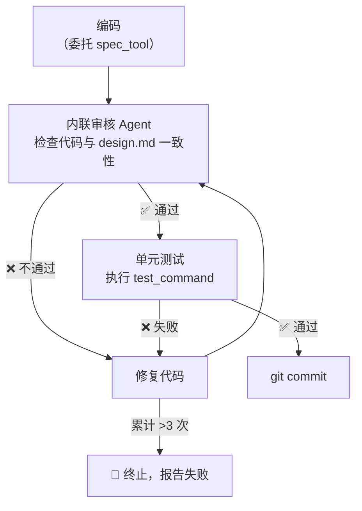

# Flow Skill — 多 Agent 编排工作流文档

> 本文档描述 Flow Skill 系统的整体架构、角色职责和完整工作流程。

---

## 一、系统概览

Flow Skill 是一套**多 Agent 编排工作流**，管理**根 Agent（编排者）**与**子 Agent（执行者）**的协作。

### 两种角色

| 角色 | 职责 | 不做什么 |
|------|------|----------|
| **根 Agent** | 需求拆分、概要设计、派发任务、查看进度、集成测试、接口验证、归档 | ❌ 不编码、不提交、不更新 task.md 完成状态 |
| **子 Agent** | 接收任务 → spec 设计 → 编码（内联审核+测试+提交）→ 汇报 → 知识库维护 | ❌ 不修改其他服务的 spec、不跳过知识库判断 |

### 通信方式

根 Agent 与子 Agent **通过文件解耦通信**，核心文件：

```
{项目根目录}/
├── .flow/
│   ├── config.yaml              ← 项目配置（服务列表、知识库、约定）
│   ├── onboarding.md            ← 子 agent 开发规范（所有服务共享）
│   ├── services.md              ← 服务地图
│   ├── feedback/                ← 线上反馈（独立于 changes，懒创建）
│   │   ├── _index.md
│   │   └── {YYYY-MM-DD}-{slug}/
│   │       ├── 反馈记录.md
│   │       └── 调查报告.md
│   └── changes/
│       └── {需求名}-{YYYYMMDD}/
│           ├── 概要设计.md       ← 整体方案、接口契约、验收标准
│           └── task.md           ← 任务清单（根写入 spec，子 report 勾选完成）
│
{服务目录}/
└── .flow/
    ├── config.yaml              ← 服务配置（指向根目录）
    └── 工作流程.md               ← 本服务工作循环说明
```

---

## 二、命令清单

| 命令 | 角色 | 说明 |
|------|:----:|------|
| `/flow:init` | 根/子 | 初始化 `.flow/` 必要文件 |
| `/flow:design` | 根/子 | 根：概要设计 + task.md + spec proposal/design；子：spec 设计 + 自检（远期） |
| `/flow:assign` | 根 | 分配任务给子 agent（内联执行 / 独立指令包） |
| `/flow:receive` | 子 | 接收任务，加载工作协议，判断当前阶段 |
| `/flow:apply` | 子 | 阶段二编码循环：编码 → 审核 → 测试 → 提交 |
| `/flow:report` | 子 | 汇报结果，更新 task.md（唯一写入者），触发知识库维护 |
| `/flow:status` | 根 | 查看需求进度（spec 粒度） |
| `/flow:verify` | 根 | 跨服务接口契约一致性验证 |
| `/flow:test` | 根 | 集成测试（HTTP / MQ / DB） |
| `/flow:change` | 根 | 需求变更协议 |
| `/flow:archive` | 根 | 归档已完成需求 |
| `/flow:feedback` | 根/子 | 线上反馈调查（`.flow/feedback/`，独立于 change） |
| `/flow:kb` | 根/子 | 知识库维护（`<change-name>` 或 `feedback/{id}`） |
| `/flow:hotfix` | 根 | 创建 hotfix 条目 + spec 目录，走 assign 派发（非 feedback 默认路径） |

---

## 三、场景一：跨服务大需求开发（根指导模式）

适用场景：Tier 2/3 的跨服务需求，需要根 Agent 统筹。



### 流程说明

| 阶段 | 执行者 | 命令 | 关键动作 |
|------|:------:|------|----------|
| 初始化 | 根 | `init` | 创建 `.flow/` 目录结构 |
| 设计 | 根 | `design` | 与用户协作：概要设计 + task.md + 每个 spec 的 proposal/design |
| 派发 | 根 | `assign` | 按依赖顺序为每个 spec 生成指令（内联或独立） |
| 接收 | 子 | `receive` | 加载协议、检查阶段、展示变更通知 |
| 编码 | 子 | `apply` | 编码→内联审核→单元测试→commit，最多重试 3 次 |
| 汇报 | 子 | `report` | 更新 task.md、强制知识库判断 |
| 检查 | 根 | `status` | 查看全局 spec 完成进度 |
| 集成测试 | 根 | `test` | 基于验收标准执行 HTTP/MQ/DB 测试 |
| 契约验证 | 根 | `verify` | 检查提供者/消费者接口一致性 |
| 归档 | 根 | `archive` | 补充结束日期，移入 archive 目录 |

---

## 四、场景二：Hotfix 紧急修复

适用场景：生产 bug，快速修复流程。



### 与正常流程的差异

- **根不执行 design**：直接用 spec skills 创建 proposal + design，跳过用户设计评审
- **子 agent 流程相同**：仍然走 receive → apply → report
- **知识库策略**：只记录坑点/根因，不记录业务规则

---

## 四之二、线上反馈调查

适用场景：生产用户反馈、字段异常、接口行为投诉。**与 change / task.md 无关联**。



### 与 Hotfix 编排的差异

| 项 | feedback 路径 | hotfix 编排 |
|----|---------------|-------------|
| 目录 | `.flow/feedback/{id}/` | task.md + OpenSpec |
| 修复 | 直接改代码 | assign → apply → report |
| KB | `/flow:kb feedback/{id}` | report 内判断 |

格式规范见 `flow/docs/schema.md` §11。

---

## 五、场景三：需求变更

适用场景：进行中的大需求发生业务变更。



### 变更传播机制

- 根 Agent 不主动推送变更，变更通知写入 task.md
- 子 Agent 下次 `receive` 时被动感知
- 根据当前阶段选择处理策略：重新设计 或 新建 change

---

## 六、场景四：用户直接模式

适用场景：Tier 1 的单服务小需求，用户直接在服务目录工作。



---

## 七、核心架构



### 关键约束

| 约束 | 说明 |
|------|------|
| **task.md 单一写入者** | 只有 `/flow:report` 勾选 spec 完成状态 |
| **1 spec = 1 commit** | 每个子 agent 只处理一个 spec |
| **文件通信** | 根不直接调用子，子不直接通知根 |
| **根不编码** | 根只做编排，所有代码由子 agent 产出 |
| **子闭环** | 子 agent 内部自动完成审核→测试→提交，不需要用户中转 |

---

## 八、子 Agent 工作循环

子 Agent 的内部三阶段工作循环：



### 内联 Agent 协作（apply 内部）



---

## 九、两种 Agent 启动模式

```
┌──────────────────────────────────────────────────────────────┐
│  独立会话（Independent Session）                              │
│  用户手动在服务目录打开新的 Claude Code 进程                    │
│  · 持久 memory：~/.claude/projects/{项目-服务名}/memory/      │
│  · 拥有独立的 CLAUDE.md、settings、skills                     │
│  · 根 agent 无法自动启动——必须由用户手动操作                   │
├──────────────────────────────────────────────────────────────┤
│  内联 agent（Inline Agent）                                   │
│  由父 agent 通过 Agent tool 启动，运行在父会话的进程内          │
│  · 无持久 memory，随父会话结束而消失                            │
│  · 继承父 agent 的 skills、settings、MCP 工具                  │
│  · 根 agent 和子 agent 都可以启动内联 agent                    │
└──────────────────────────────────────────────────────────────┘
```

---

## 十、文件模板清单

| 模板 | 生成时机 | 内容 |
|------|---------|------|
| `onboarding.md.tmpl` | `init`（根） | 二级架构说明 + 子 agent 开发规范 |
| `config.yaml.tmpl`（根） | `init`（根） | 项目配置、服务列表、知识库、约定 |
| `config.yaml.tmpl`（子） | `init`（子） | 服务配置、inline_agents 配置 |
| `工作流程.md.tmpl` | `init`（子） | 服务级工作循环说明，含测试命令 |
| `概要设计.md` | `design`（根） | 背景、目标、服务边界、接口契约、验收标准 |
| `task.md` | `design`（根） | 按服务分组的 spec 清单（边界+依赖） |
| `proposal.md` | `design`（根/子） | 单个 spec 的背景、目标、方案 |
| `design.md` | `design`（根/子） | 单个 spec 的详细设计 |
| `api.md` | `apply`（子） | 接口变更文档（新增/修改/废弃） |
| `fix.md` | `hotfix`（根） | bug 描述、复现、根因、修复方案 |
| `feedback-*.md.tmpl` | `feedback`（懒创建） | 反馈记录、调查报告、台账 index |
| `feedback-kb-rules.md` | `kb feedback/{id}` | 调查报告 → KB 映射与段落模板 |

---

> 完整设计文档见 `flow-redesign.md`，数据格式规范见 `flow/docs/schema.md`。
